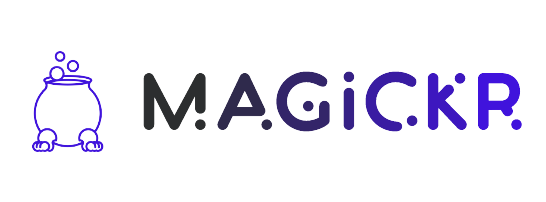

---
### What is it?

The Magickr project is a way to bring gamification to the Development flow, it will integrate with Jira, Azure Boards and 
chats in general, creating a fun way to track development and bring engagement to IT teams.

### Current Status

Welp, this is a toy project that i'm using to learn Scala 3, so don't expect it to be the most beautiful thing from start,
it will improve with time, i hope. 

### Running

    sbt run

